# CEBU INSTITUTE OF TECHNOLOGY - UNIVERSITY
## COLLEGE OF COMPUTER STUDIES
### Software Requirements Specification
### for
# EventQR: Smart QR Code-Based Event Access and Attendee Transaction Management System

---

## Document Control

### Change History

| Version | Date | Author / Team | Description |
|---|---|---|---|
| 0.1 | April 4, 2026 | Team 2526-sem2-it332-24 | Initial SRS document prepared based on approved proposal and SRS template. |
| 0.2 | April 10, 2026 | Team 2526-sem2-it332-24 | Revisions to Introduction (Sections 1.1 to 1.4). |
| 0.3 | April 11, 2026 | Team 2526-sem2-it332-24 | Revisions to Overall Description (Sections 2.1 to 2.4). |
| 0.4 | April 12, 2026 | Team 2526-sem2-it332-24 | Initial Specific Requirements draft (Sections 3.1 to 3.3). |
| 0.5 | April 14, 2026 | Team 2526-sem2-it332-24 | Added Use Case diagrams across functional requirement modules. |
| 0.6 | April 15, 2026 | Team 2526-sem2-it332-24 | Added Activity diagrams across functional requirement modules. |
| 0.7 | April 16, 2026 | Team 2526-sem2-it332-24 | Added initial wireframes and screen interaction definitions. |
| 0.8 | April 18, 2026 | Team 2526-sem2-it332-24 | Finalized baseline SRS document and section numbering. |
| 1.0 | September 22, 2026 | Team 2526-sem2-it332-24 | Comprehensive SRS update reflecting fully implemented architecture: Java 21 / Spring Boot 3.5.x backend, PostgreSQL database with Flyway versioned migrations (V1–V26), Brevo asynchronous QR email delivery (`QREmailService`), Android Jetpack Compose client, CR80 ID card generation/printing (`AndroidIdPrinter`), 5-role RBAC (`SUPER_ADMIN`, `ADMIN`, `ORGANIZER`, `STAFF`, `ATTENDEE`), enhanced scan purpose rules engine (duplicate window, max uses, points awarded), point balance ledger, audit logging, and formalized Mermaid Use Case and Activity Diagrams. |

---

## Table of Contents

1. [Introduction](#1-introduction)
   - 1.1. [Purpose](#11-purpose)
   - 1.2. [Scope](#12-scope)
   - 1.3. [Definitions, Acronyms, and Abbreviations](#13-definitions-acronyms-and-abbreviations)
   - 1.4. [References](#14-references)
2. [Overall Description](#2-overall-description)
   - 2.1. [Product Perspective](#21-product-perspective)
   - 2.2. [User Characteristics](#22-user-characteristics)
   - 2.3. [Constraints](#23-constraints)
   - 2.4. [Assumptions and Dependencies](#24-assumptions-and-dependencies)
3. [Specific Requirements](#3-specific-requirements)
   - 3.1. [External Interface Requirements](#31-external-interface-requirements)
     - 3.1.1. [Hardware Interfaces](#311-hardware-interfaces)
     - 3.1.2. [Software Interfaces](#312-software-interfaces)
     - 3.1.3. [Communications Interfaces](#313-communications-interfaces)
   - 3.2. [System UML Diagrams](#32-system-uml-diagrams)
     - 3.2.1. [System Use Case Diagram](#321-system-use-case-diagram)
     - 3.2.2. [System Activity Diagram](#322-system-activity-diagram)
   - 3.3. [Functional Requirements](#33-functional-requirements)
     - [Module 1: Pre-Event Registration and QR Credential Generation](#module-1-pre-event-registration-and-qr-credential-generation)
     - [Module 2: On-Site QR Verification, ID Printing, and Event Transactions](#module-2-on-site-qr-verification-id-printing-and-event-transactions)
     - [Module 3: Organizer & Admin Event Management and Dashboard](#module-3-organizer--admin-event-management-and-dashboard)
     - [Module 4: Event Rewards and Point-Based Redemption](#module-4-event-rewards-and-point-based-redemption)
   - 3.4. [Non-Functional Requirements](#34-non-functional-requirements)
     - 3.4.1. [Performance Requirements](#341-performance-requirements)
     - 3.4.2. [Security Requirements](#342-security-requirements)
     - 3.4.3. [Reliability Requirements](#343-reliability-requirements)
     - 3.4.4. [Maintainability & Usability Requirements](#344-maintainability--usability-requirements)

---

# 1. Introduction

## 1.1. Purpose
The purpose of this document is to provide a complete and authoritative Software Requirements Specification (SRS) for the **Smart QR Code-Based Event Access and Attendee Transaction Management System (EventQR)**. This document establishes the functional and non-functional requirements of the system for project developers, architects, QA engineers, system evaluators, event organizers, and administrative stakeholders.

EventQR addresses inefficiency, credential fragmentation, fraudulent attendance, and slow manual checkpoints at institutional and campus events. The system unifies attendee registration, digital QR credential generation, asynchronous email delivery, multi-purpose on-site scanning (check-in, session attendance, booth tracking, benefit claiming, exit logging), on-demand CR80 physical ID badge printing, rule-governed duplicate transaction suppression, real-time gamified reward point accrual, reward redemption, administrative event review, and consolidated event reporting through a single reusable QR token.

## 1.2. Scope
The EventQR platform comprises a distributed, enterprise-grade architecture consisting of:
1. A **Java 21 / Spring Boot 3.5 backend API service** backed by **PostgreSQL** with **Flyway** schema migrations.
2. A native **Android mobile application** built using **Kotlin**, **Jetpack Compose**, **Retrofit**, and **ZXing**.
3. An **External Cloud Email Service (Brevo)** for transactional asynchronous QR credential delivery.
4. Integrated **Android Print Framework** services for wireless/network CR80 identification badge rasterization and printing.

The system encompasses five distinct user roles with strict role-based access control (RBAC):
- **Super Administrator (`SUPER_ADMIN`)**: Master platform administrator possessing authority over administrative user provisioning, system configuration, and high-level platform health.
- **Administrator (`ADMIN`)**: Institutional overseer responsible for evaluating self-serve event creation requests, approving/rejecting proposals, elevating users to organizer roles, creating staff/organizer accounts, and reviewing platform audit logs.
- **Event Organizer (`ORGANIZER`)**: Event host responsible for creating and configuring events, managing event lifecycle statuses (`DRAFT`, `PENDING_REVIEW`, `APPROVED`, `ACTIVE`, `ENDED`, `CANCELLED`), configuring scan purposes and validation rules (points, duplicate scan time windows, max uses per registration), designing/previewing ID templates, assigning staff, managing rewards, and accessing live dashboards and analytics reports.
- **Event Staff (`STAFF`)**: Field personnel assigned to specific events who operate mobile camera scanners to verify attendee credentials, execute scan purposes (Entry, Exit, Attendance, Benefit Claim, Booth Visit, Reward Redemption), handle rule-based exceptions, and initiate physical ID badge printing.
- **Attendee (`ATTENDEE`)**: Public or student participant who discovers events, registers, receives a tamper-resistant QR credential (`EVQR-<32 hex>`) via in-app display and email, presents credentials at physical gates, accumulates event participation points, and redeems event rewards.

## 1.3. Definitions, Acronyms, and Abbreviations

| Term / Acronym | Definition |
|---|---|
| **EventQR** | The Smart QR Code-Based Event Access and Attendee Transaction Management System. |
| **SRS** | Software Requirements Specification; defining functional and non-functional requirements. |
| **RBAC** | Role-Based Access Control; enforcing authorization constraints based on assigned user roles. |
| **QR Code** | Quick Response Code; a two-dimensional matrix barcode containing encoded credential data. |
| **QR Credential** | A cryptographically secure, uniquely generated token payload (formatted as `EVQR-<32 hex>`) assigned to an attendee event registration. |
| **CR80** | Standard credit-card size identification card (85.60 mm × 53.98 mm) targeted by the EventQR ID card printing pipeline. |
| **Brevo** | External cloud transactional email delivery API provider formerly known as Sendinblue. |
| **Flyway** | Open-source database migration engine ensuring repeatable, versioned database migrations (`V1` through `V26`). |
| **JWT** | JSON Web Token; compact, URL-safe means of representing claims securely between client and server. |
| **Scan Purpose** | Configurable operational objective behind a QR scan (e.g., `ENTRY`, `EXIT`, `ATTENDANCE`, `BENEFIT_CLAIM`, `BOOTH_VISIT`, `REWARD_REDEMPTION`). |
| **Transaction Rule** | System constraint bound to a scan purpose determining point values, duplicate time windows (`duplicate_window_minutes`), maximum uses (`max_uses_per_registration`), and staff assignment prerequisites. |
| **Point Balance Ledger** | Dual-table accounting model utilizing immutable ledger entries (`point_transactions`) and optimized aggregate tables (`attendee_point_balances`). |
| **Audit Log** | Immutable append-only log record (`audit_logs`) documenting system actions, timestamps, and the identity of performing users. |

## 1.4. References
1. IEEE Std 830-1998: *IEEE Recommended Practice for Software Requirements Specifications*.
2. Cebu Institute of Technology - University, College of Computer Studies: *Capstone Project SRS Guidelines*.
3. Spring Boot 3.5 Reference Documentation, VMware Tanzu.
4. Android Jetpack Compose Developer Guide, Google Developers.
5. RFC 7519: *JSON Web Token (JWT)*, Internet Engineering Task Force (IETF).
6. Masalha, F., & Hirzallah, N. (2014). *A students attendance system using QR code*. International Journal of Advanced Computer Science and Applications.
7. Rajendran, J., & Hamzah, M. H. I. (2021). *QR code based event management system*. Journal of Computing Research and Innovation.
8. EventQR Source Code Repositories, Database Migrations (`V1` to `V26`), and Design Documents (`FinalFlow.md`, `DEMO_SCRIPT.md`).

---

# 2. Overall Description

## 2.1. Product Perspective
EventQR operates as a multi-tier client-server system. The server layer runs on Spring Boot 3.5 with Java 21, interfacing with PostgreSQL for relational persistence. The mobile client is a modern Android application built using Kotlin and Jetpack Compose. Communication is strictly handled via RESTful JSON endpoints over TLS, secured by signed JWT bearer tokens.

```
+-----------------------------------------------------------------------------------+
|                                 EVENTQR SYSTEM                                    |
|                                                                                   |
|  +-----------------------------------------------------------------------------+  |
|  |                           Mobile Client (Android)                           |  |
|  |  +-------------------+  +-------------------+  +-------------------------+  |  |
|  |  | Attendee Portal   |  | Staff Scanner UI  |  | Organizer / Admin View  |  |  |
|  |  +-------------------+  +-------------------+  +-------------------------+  |  |
|  +-----------------------------------------------------------------------------+  |
|                                       | (HTTPS / REST API with JWT)               |
|                                       v                                           |
|  +-----------------------------------------------------------------------------+  |
|  |                        Backend Service (Spring Boot 3.5)                    |  |
|  |  +-----------------------------------------------------------------------+  |  |
|  |  | Security Filter -> JWT Validation -> Feature Controllers & Services  |  |  |
|  |  +-----------------------------------------------------------------------+  |  |
|  |  | EventEngine | QREngine | RulesEngine | PointsLedger | IDPrintRaster   |  |  |
|  |  +-----------------------------------------------------------------------+  |  |
|  +-----------------------------------------------------------------------------+  |
|             |                                   |                    |            |
|             v                                   v                    v            |
|  +-----------------------+           +-------------------+   +-----------------+  |
|  | PostgreSQL Database   |           | Brevo Email API   |   | Network / OS    |  |
|  | (Flyway V1 - V26)     |           | (Async QR Mail)   |   | Print Manager   |  |
|  +-----------------------+           +-------------------+   +-----------------+  |
+-----------------------------------------------------------------------------------+
```

## 2.2. User Characteristics

| User Role | Responsibilities and Technical Profile |
|---|---|
| **Attendee** | Tech-literate general user or student. Interacts with the mobile app to search events, register, retrieve QR credentials in-app or via email, view real-time point balances, and claim rewards. Minimal training required. |
| **Event Staff** | Event crew or student volunteers. Operates mobile camera scanners at venue entrances or activity booths. Responsible for verifying QR codes, monitoring validation messages, executing scan purposes, printing physical badges, and handing out rewards. Requires basic orientation on scan purposes. |
| **Event Organizer** | Authorized event manager. Configures event details, staff assignments, scan purpose rules, points, rewards, and ID badge layouts. Monitors real-time attendance and exports post-event analytics. Moderate system familiarity. |
| **Administrator** | System administrative personnel. Reviews incoming event requests, evaluates event parameters, approves/rejects requests, manages user role upgrades, and inspects platform audit trails. |
| **Super Administrator** | Lead system administrator. Manages platform setup, provisions administrator accounts, configures platform integrations, and resolves tenant security issues. |

## 2.3. Constraints
1. **Device & OS Requirements**: The mobile client targets Android API level 26 (Android 8.0 Oreo) and above.
2. **Camera Hardware**: Mobile devices operating in Staff mode require an autofocus-capable back camera with adequate resolution to decode QR matrices rapidly under diverse ambient lighting.
3. **Network Connectivity**: Verification, transaction recording, point balance synchronization, and report compilation require active HTTP/HTTPS network connectivity.
4. **Email Delivery Dependency**: Transactional email delivery depends on external API availability (Brevo). To maintain zero latency for the attendee, email dispatch is non-blocking and queued asynchronously.
5. **Database Governance**: All schema adjustments must be executed via immutable, version-controlled Flyway SQL migrations. Direct manual schema modifications are prohibited.
6. **Physical ID Printing**: ID card generation is constrained by the Android PrintManager framework and printer hardware support for standard CR80 card rasterization (single or 3x3 sheet layout).

## 2.4. Assumptions and Dependencies
1. **Host Infrastructure**: The backend service runs in a containerized environment (Docker/Linux) with Java 21 OpenJDK and persistent PostgreSQL storage.
2. **Credential Integrity**: The attendee QR payload (`EVQR-<32 hex>`) is assumed to be tamper-resistant and tied directly to an immutable registration ID within the database.
3. **Clock Synchronization**: Network devices must have accurate system clocks synchronized via NTP to ensure time-windowed duplicate transaction rules function correctly.

---

# 3. Specific Requirements

## 3.1. External Interface Requirements

### 3.1.1. Hardware Interfaces
- **Mobile Handsets & Tablets**: Touchscreen Android devices utilized by attendees, staff, and organizers.
- **Camera Sensor**: Integrated camera hardware accessed via CameraX / ZXing scanning libraries for QR capture.
- **ID Card Printer**: Thermal or inkjet printers capable of accepting standard print jobs via Wi-Fi, Bluetooth, or local network print spoolers.

### 3.1.2. Software Interfaces
- **Operating System**: Android OS 8.0+ (API 26+) for client devices.
- **Backend Framework**: Spring Boot 3.5.x on Java 21.
- **Relational Database**: PostgreSQL 15+ managing structured tables (`events`, `event_registrations`, `qr_credentials`, `transaction_logs`, `point_transactions`, etc.).
- **Database Migration Framework**: Flyway versioned migration engine.
- **Barcode Engine**: ZXing ("Zebra Crossing") barcode image processing library.
- **Email Gateway**: Brevo RESTful HTTP API service.

### 3.1.3. Communications Interfaces
- **Client-Server Protocol**: HTTPS with JSON payloads conforming to standard API response wrappers (`ApiResponse<T>`).
- **Security Protocols**: TLS 1.3 encryption for in-transit data; JWT Bearer tokens in `Authorization: Bearer <token>` headers.
- **Printer Spooling**: Android `PrintManager` and custom `PrintDocumentAdapter` generating standard PDF/Bitmap streams.

---

## 3.2. System UML Diagrams

### 3.2.1. System Use Case Diagram
The following diagram formally models all primary system actors, business use cases across Modules 1 through 4, actor associations, and mandatory UML `<<include>>` relationships using Mermaid `usecase-beta`.

```mermaid
usecase-beta

actor Attendee("Attendee")
actor Staff("Event Staff")
actor Organizer("Event Organizer")
actor Admin("Administrator")
actor SuperAdmin("Super Administrator")

%% Module 1: Pre-Event Registration & Credentialing
RegisterEvent("Register for Event")
GenerateQR("Generate Unique QR Credential")
LinkQR("Link QR to Registration Record")
ViewQR("View & Download QR Credential")
SendQREmail("Send Event QR Code via Email")

%% Module 2: On-Site Verification, ID Printing & Transactions
SelectScanPurpose("Select Scan Purpose")
VerifyQR("Verify Attendee QR Code")
RecordEntry("Log Event Entry (Check-In)")
RecordAttendance("Record Attendance")
ValidateBenefit("Validate Benefit Claim")
TrackBooth("Track Booth / Session Visit")
LogExit("Log Event Exit")
ProcessRedemptionScan("Process Reward Redemption Scan")
PrintID("Print / Reprint Attendee ID")
RejectTransaction("Reject Duplicate or Invalid Transaction")

%% Module 3: Event Management, Administration & Governance
SubmitEventRequest("Submit Event Creation Request")
ReviewEventRequest("Review Event Creation Request")
ApproveRejectRequest("Approve or Reject Event Request")
UpgradeToOrganizer("Upgrade User to Organizer Role")
ManageEvents("Manage Events (Create, Update, Cancel)")
AssignStaff("Manage Staff Assignment")
ConfigureIDTemplate("Configure ID Template")
ConfigureScanRules("Configure Scan Purposes & Transaction Rules")
ViewAttendees("View Attendee Records & Status")
SearchAttendees("Search & Filter Attendees")
ViewLogs("View Transaction & Audit Logs")
GenerateReports("Generate Event Reports & Analytics")
ManageUsers("Manage Users & Admin Accounts")

%% Module 4: Rewards & Points System
ConfigureRewards("Enable / Disable & Manage Rewards")
ConfigurePointRules("Configure Event Point Rules")
SetTrackingOnly("Set Tracking-Only Scan Purposes")
AwardPoints("Assign & Update Event Points")
RecordPointTransaction("Record Point Transaction")
RedeemReward("Redeem Reward with Points")
PreventDuplicateReward("Prevent Duplicate Reward Claims")

%% Actor Connections
Attendee --> RegisterEvent
Attendee --> ViewQR
Attendee --> SubmitEventRequest
Attendee --> RedeemReward

Staff --> SelectScanPurpose
Staff --> VerifyQR
Staff --> RecordEntry
Staff --> RecordAttendance
Staff --> ValidateBenefit
Staff --> TrackBooth
Staff --> LogExit
Staff --> ProcessRedemptionScan
Staff --> PrintID

Organizer --> ManageEvents
Organizer --> AssignStaff
Organizer --> ConfigureIDTemplate
Organizer --> ConfigureScanRules
Organizer --> ConfigureRewards
Organizer --> ConfigurePointRules
Organizer --> SetTrackingOnly
Organizer --> ViewAttendees
Organizer --> SearchAttendees
Organizer --> ViewLogs
Organizer --> GenerateReports

Admin --> ReviewEventRequest
Admin --> ApproveRejectRequest
Admin --> UpgradeToOrganizer
Admin --> ManageUsers
Admin --> ViewLogs

SuperAdmin --> ManageUsers

%% Mandatory Reusable Behaviors (<<include>>)
RegisterEvent ..> GenerateQR : <<include>>
GenerateQR ..> LinkQR : <<include>>
RegisterEvent ..> SendQREmail : <<include>>

RecordEntry ..> VerifyQR : <<include>>
RecordAttendance ..> VerifyQR : <<include>>
ValidateBenefit ..> VerifyQR : <<include>>
TrackBooth ..> VerifyQR : <<include>>
LogExit ..> VerifyQR : <<include>>
ProcessRedemptionScan ..> VerifyQR : <<include>>
PrintID ..> VerifyQR : <<include>>

RecordEntry ..> AwardPoints : <<include>>
AwardPoints ..> RecordPointTransaction : <<include>>

RedeemReward ..> PreventDuplicateReward : <<include>>
```

---

### 3.2.2. System Activity Diagram
The following activity diagram depicts the end-to-end chronological lifecycle of EventQR using Mermaid `flowchart TD` with swimlanes. It models event initialization, proposal approval, configuration, attendee registration, async QR dispatch, camera verification, rule evaluation, transaction recording, point accounting, reward redemption, and post-event reporting.

```mermaid
flowchart TD

subgraph Admin["Administrator"]
    AdmStart([Start]) --> AdmReviewReq[Review Event Creation Request]
    AdmReviewReq --> AdmDecision{Approve Request?}
    AdmDecision -->|Yes| AdmApprove[Approve Request & Upgrade Requester to Organizer]
    AdmDecision -->|No| AdmReject[Reject Request with Reason]
    AdmAudit[Monitor System Audit Logs]
end

subgraph Organizer["Event Organizer"]
    OrgCreateEvent[Create Event Details & Set Capacity]
    OrgCorrectEvent[Update Invalid Event Information]
    OrgAssignStaff[Assign Staff to Event with Role Permissions]
    OrgConfigRules[Configure Scan Purposes, Transaction Rules & Points]
    OrgConfigRewards[Configure Rewards & Stock]
    OrgPublishEvent[Publish Event for Attendee Registration]
    OrgViewReports[Review Dashboard Analytics, Attendee Lists & Transaction Reports]
end

subgraph Attendee["Attendee"]
    AttBrowse[Browse Published Events]
    AttSubmitReg[Submit Event Registration]
    AttViewRegError[View Registration Rejection Message]
    AttReceiveQR[Receive QR via Email & View In-App Credential]
    AttSaveQR[Download / Save QR Credential to Gallery]
    AttPresentQR[Present QR Credential at Venue]
    AttBrowseRewards[Browse Available Event Rewards]
    AttSubmitClaim[Submit Reward Claim]
    AttViewClaimError[View Ineligible / Out of Stock Message]
    AttReceiveItem[Receive Reward Item]
    AttDepart[Present QR for Exit Scan & Depart Venue]
end

subgraph Staff["Event Staff"]
    StfSelectEvent[Log In & Select Assigned Event]
    StfSelectPurpose[Select Scan Purpose: Entry, Session, Booth, or Exit]
    StfScanQR[Scan Attendee QR Code via Camera]
    StfDisplayError[View Scan Rejection / Duplicate Violation Alert]
    StfDisplaySuccess[View Verification Success & Check-In Confirmation]
    StfCheckPrint{Print Physical ID Card?}
    StfPrintID[Trigger CR80 ID Card Printing]
    StfScanRedeem[Scan & Process Reward Redemption]
    StfDispense[Verify Eligibility & Dispense Reward Item]
    StfScanExit[Scan Attendee Exit QR]
    StfCheckMore{More Attendees to Process?}
end

subgraph System["EventQR Platform"]
    SysValEvent{Event Details Valid?}
    SysSaveDraft[Save Event Record]
    SysCheckCapacity{Capacity Available & Not Registered?}
    SysCreateReg[Create Event Registration Record]
    SysGenQR[Generate Unique QR Credential EVQR-Hex]
    SysLinkQR[Link QR Credential to Registration Record]
    SysQueueEmail[Queue Asynchronous QR Email Delivery via Brevo]
    SysVerifyQR{Valid QR & Linked to Event?}
    SysCheckRules{Transaction Rules Passed? Duplicate / Max Uses Check}
    SysLogRejection[Record Rejected Scan in Transaction Logs]
    SysLogApproval[Record Approved Transaction in Transaction Logs]
    SysUpdateStatus[Update Registration Status to Entered / Attended]
    SysCheckPoints{Scan Purpose Awards Points?}
    SysAwardPoints[Record Point Transaction & Update Attendee Point Balance]
    SysRasterizeID[Rasterize CR80 ID Card Layout with QR Bitmap]
    SysCheckReward{Sufficient Points & Stock Available?}
    SysDeductPoints[Deduct Points & Record Pending Redemption]
    SysConfirmRedemption[Update Redemption Status to Redeemed]
    SysLogExit[Record Exit Transaction & Timestamp]
    SysGenAnalytics[Compile Attendance Ratios, Points Ledger & Event Reports]
end

AdmApprove --> OrgCreateEvent
AdmReject --> AttViewRegError

OrgCreateEvent --> SysValEvent
SysValEvent -->|No| OrgCorrectEvent
OrgCorrectEvent --> SysValEvent
SysValEvent -->|Yes| SysSaveDraft
SysSaveDraft --> OrgAssignStaff
OrgAssignStaff --> OrgConfigRules
OrgConfigRules --> OrgConfigRewards
OrgConfigRewards --> OrgPublishEvent

OrgPublishEvent --> AttBrowse
AttBrowse --> AttSubmitReg
AttSubmitReg --> SysCheckCapacity

SysCheckCapacity -->|No| AttViewRegError
SysCheckCapacity -->|Yes| SysCreateReg

SysCreateReg --> SysGenQR
SysGenQR --> SysLinkQR
SysLinkQR --> SysQueueEmail
SysQueueEmail --> AttReceiveQR
AttReceiveQR --> AttSaveQR

OrgAssignStaff -.-> StfSelectEvent
StfSelectEvent --> StfSelectPurpose
AttSaveQR --> AttPresentQR
AttPresentQR --> StfScanQR
StfSelectPurpose --> StfScanQR

StfScanQR --> SysVerifyQR
SysVerifyQR -->|No| SysLogRejection
SysVerifyQR -->|Yes| SysCheckRules

SysCheckRules -->|No| SysLogRejection
SysLogRejection --> StfDisplayError

SysCheckRules -->|Yes| SysLogApproval
SysLogApproval --> SysUpdateStatus
SysUpdateStatus --> SysCheckPoints

SysCheckPoints -->|Yes| SysAwardPoints
SysCheckPoints -->|No| StfDisplaySuccess
SysAwardPoints --> StfDisplaySuccess

StfDisplaySuccess --> StfCheckPrint
StfCheckPrint -->|Yes| StfPrintID
StfPrintID --> SysRasterizeID
StfCheckPrint -->|No| AttBrowseRewards
SysRasterizeID --> AttBrowseRewards

AttBrowseRewards --> AttSubmitClaim
AttSubmitClaim --> SysCheckReward
SysCheckReward -->|No| AttViewClaimError
SysCheckReward -->|Yes| SysDeductPoints
SysDeductPoints --> StfScanRedeem
StfScanRedeem --> SysConfirmRedemption
SysConfirmRedemption --> StfDispense
StfDispense --> AttReceiveItem

AttReceiveItem --> AttDepart
AttDepart --> StfScanExit
StfScanExit --> SysLogExit

SysLogExit --> StfCheckMore
StfDisplayError --> StfCheckMore
StfCheckMore -->|Yes| StfScanQR
StfCheckMore -->|No| SysGenAnalytics

SysGenAnalytics --> OrgViewReports
OrgViewReports --> AdmAudit
AdmAudit --> EndNode([End])
```



---

## 3.3. Functional Requirements

### Module 1: Pre-Event Registration and QR Credential Generation

#### UC-01: Register Attendee
| Field | Description |
|---|---|
| **Use Case ID** | **UC-01** |
| **Use Case Name** | **Register Attendee** |
| **Primary Actor(s)** | Attendee |
| **Goal** | Allow an authenticated attendee to register for an active, published event before its capacity or registration cutoff is reached. |
| **Preconditions** | User is authenticated with `ATTENDEE` role. Target event has status `APPROVED` or `ACTIVE`, current attendee count is less than capacity, and registration window is open. |
| **Trigger** | Attendee views event details and submits the registration form. |
| **Postconditions** | An `event_registrations` record is created with status `REGISTERED`. System triggers QR generation and email dispatch. |
| **Main Flow** | 1. Attendee opens event details.<br>2. Attendee clicks Register.<br>3. Backend validates that event is open and user is not already registered.<br>4. Backend checks available capacity.<br>5. Registration record is inserted with assigned sequential registration number.<br>6. Backend increments event attendee count.<br>7. System invokes UC-02 (`Generate Unique QR Code`) as mandatory include.<br>8. System returns registration and credential snapshot to mobile client. |
| **Alternative Flows** | - Event Full: Backend returns `400 Bad Request` ("Event is at full capacity").<br>- Already Registered: Backend returns `409 Conflict` ("User already registered for this event").<br>- Registration Closed: Backend returns `400 Bad Request` ("Registration window has closed"). |

#### UC-02: Generate Unique QR Code
| Field | Description |
|---|---|
| **Use Case ID** | **UC-02** |
| **Use Case Name** | **Generate Unique QR Code** |
| **Primary Actor(s)** | System |
| **Goal** | Construct a collision-free digital QR payload string and credential record upon attendee registration. |
| **Preconditions** | A valid `event_registrations` record has been successfully inserted. |
| **Trigger** | Triggered automatically by the registration pipeline. |
| **Postconditions** | A unique `qr_credentials` record is generated, linked, and set to active. |
| **Main Flow** | 1. System constructs a secure random token adhering to pattern `EVQR-<32 hex characters>`.<br>2. System validates unicity against existing active credentials in `qr_credentials`.<br>3. System creates the `qr_credentials` record.<br>4. System invokes UC-03 (`Link QR Code to Attendee Event Registration Record`). |
| **Alternative Flows** | - Token collision (probability < 10^-38): System regenerates a new random hex token and retries insertion. |

#### UC-03: Link QR Code to Attendee Event Registration Record
| Field | Description |
|---|---|
| **Use Case ID** | **UC-03** |
| **Use Case Name** | **Link QR Code to Attendee Event Registration Record** |
| **Primary Actor(s)** | System |
| **Goal** | Establish an immutable relational association between the QR credential and the attendee registration. |
| **Preconditions** | A valid registration and generated QR credential record exist. |
| **Trigger** | Completion of QR token generation. |
| **Postconditions** | Foreign keys `event_registrations.qr_credential_id` and `qr_credentials.registration_id` are populated. |
| **Main Flow** | 1. System links `qr_credential_id` to the target `event_registrations` record.<br>2. System updates registration record in database.<br>3. System makes the credential accessible via attendee lookup endpoints. |

#### UC-04: View and Download QR Credential
| Field | Description |
|---|---|
| **Use Case ID** | **UC-04** |
| **Use Case Name** | **View and Download QR Credential** |
| **Primary Actor(s)** | Attendee |
| **Goal** | Enable attendees to view their QR pass immediately after registration, re-open it at any time from their registered events list, and save a PNG image to their device gallery. |
| **Preconditions** | Attendee possesses a valid registration and linked QR credential. |
| **Trigger** | Attendee completes registration or taps an event card under the "Registered" tab. |
| **Postconditions** | The QR credential matrix is rendered on screen via ZXing; optional local image file saved to storage. |
| **Main Flow** | 1. Client opens `AttendeeQrCredentialActivity` or `QrDisplayActivity`.<br>2. App calls `/api/v1/attendee/my-registrations/{id}/qr-credential`.<br>3. Backend returns credential snapshot and marks `display_status = 'DISPLAYED'`.<br>4. App encodes `qrValue` into a 512x512 bitmap and displays it.<br>5. Attendee taps "Save to Gallery".<br>6. Bitmap is written to MediaStore/Pictures and system marks `downloaded = true`. |
| **Alternative Flows** | - Storage permission rejected (legacy Android): App alerts user and advises using email copy. |

#### UC-05: Send Event QR Code through Email
| Field | Description |
|---|---|
| **Use Case ID** | **UC-05** |
| **Use Case Name** | **Send Event QR Code through Email** |
| **Primary Actor(s)** | System, Attendee |
| **Goal** | Asynchronously deliver the attendee's QR credential to their registered email address using Brevo. |
| **Preconditions** | Registration and QR linking completed successfully. |
| **Trigger** | Event registration completion hook in backend. |
| **Postconditions** | Email dispatched via Brevo API and delivery logged in `email_delivery_logs`. |
| **Main Flow** | 1. System enqueues email dispatch task in `QREmailService`.<br>2. Service constructs HTML body embedding the QR code image and event details.<br>3. Service executes HTTP POST to Brevo API gateway.<br>4. Service logs dispatch result in `email_delivery_logs`.<br>5. Attendee receives confirmation email with scannable QR. |
| **Alternative Flows** | - External API error: System logs failure in `email_delivery_logs` with error payload; attendee can still access credential via in-app viewer. |

---

### Module 2: On-Site QR Verification, ID Printing, and Event Transactions

#### UC-06: Select Scan Purpose
| Field | Description |
|---|---|
| **Use Case ID** | **UC-06** |
| **Use Case Name** | **Select Scan Purpose** |
| **Primary Actor(s)** | Staff |
| **Goal** | Allow assigned staff to choose the specific transaction purpose prior to scanning attendee credentials. |
| **Preconditions** | Staff user is assigned to the active event with `can_scan = true`. Scan purposes are configured. |
| **Trigger** | Staff opens Scanner tab in the mobile client. |
| **Postconditions** | Selected scan purpose is loaded into the scanner context for subsequent scans. |
| **Main Flow** | 1. Staff selects assigned event.<br>2. Staff opens Scanner screen.<br>3. Client loads active scan purposes (e.g. Check-In, Booth Visit, Benefit Claim, Exit).<br>4. Staff selects target purpose from dropdown/chips.<br>5. Scanner initializes camera preview ready for barcodes. |

#### UC-07: Verify Attendee QR Code
| Field | Description |
|---|---|
| **Use Case ID** | **UC-07** |
| **Use Case Name** | **Verify Attendee QR Code** |
| **Primary Actor(s)** | Staff, Attendee |
| **Goal** | Scan and validate an attendee's QR credential, retrieving registration status and attendee profile. |
| **Preconditions** | Staff has camera scanner active; attendee presents digital or printed QR code. |
| **Trigger** | Staff points camera at attendee QR code. |
| **Postconditions** | Backend verifies credential authenticity and returns attendee verification snapshot. |
| **Main Flow** | 1. ZXing decodes barcode into string `qrValue`.<br>2. Client sends verification request with `qrValue`, `eventId`, and `scanPurposeId`.<br>3. Backend validates that QR exists, is active, and matches the specified event.<br>4. Backend checks attendee registration status (`REGISTERED`, `ATTENDED`).<br>5. System returns attendee profile, photo path, and eligibility status. |
| **Alternative Flows** | - Unrecognized QR code: Backend returns `404 Not Found`; scanner displays red failure banner.<br>- Wrong event: Backend returns `400 Bad Request` ("Credential belongs to a different event"). |

#### UC-08: Print or Reprint Attendee ID
| Field | Description |
|---|---|
| **Use Case ID** | **UC-08** |
| **Use Case Name** | **Print or Reprint Attendee ID** |
| **Primary Actor(s)** | Staff |
| **Goal** | Rasterize and print an official CR80 physical ID badge featuring attendee details and QR credential. |
| **Preconditions** | Attendee registration verified; staff has `can_print_id = true`; printer connected. |
| **Trigger** | Staff taps "Print ID" on attendee details screen. |
| **Postconditions** | ID card layout rendered, spooled to printer, and logged in `id_print_logs`. |
| **Main Flow** | 1. Staff selects Print ID.<br>2. System retrieves organizer-selected ID template and attendee data.<br>3. `AndroidIdPrinter` rasterizes card layout (CR80 proportions) with attendee name, role, registration number, and QR code.<br>4. Android `PrintManager` submits print job to target printer.<br>5. Client logs print success in `id_print_logs` via backend API. |
| **Alternative Flows** | - Reprint: Staff selects "Reprint ID"; system flags `reprint = true` in `id_print_logs` for audit tracking. |

#### UC-09: Log Event Entry (Check-In)
| Field | Description |
|---|---|
| **Use Case ID** | **UC-09** |
| **Use Case Name** | **Log Event Entry (Check-In)** |
| **Primary Actor(s)** | Staff, Attendee |
| **Goal** | Validate attendee entrance into the event venue, update registration status, and award check-in points. |
| **Preconditions** | Staff scanner configured with `ENTRY` / Check-In purpose. Attendee has valid registration. |
| **Trigger** | Staff scans attendee QR at venue entrance. |
| **Postconditions** | Transaction recorded in `transaction_logs`, `entered_at` recorded, points credited. |
| **Main Flow** | 1. Staff scans attendee QR code.<br>2. System invokes UC-07 (`Verify Attendee QR Code`).<br>3. System evaluates transaction rules (duplicate entry check).<br>4. System records `APPROVED` entry in `transaction_logs`.<br>5. System updates `event_registrations.entered_at` and `checked_in_by_user_id`.<br>6. System invokes UC-32 (`Assign and Update Event-Specific Points`).<br>7. Staff scanner displays green check-in confirmation. |
| **Alternative Flows** | - Already Checked In: System blocks duplicate if duplicate entry is disallowed by event rule. |

#### UC-10: Record Attendance
| Field | Description |
|---|---|
| **Use Case ID** | **UC-10** |
| **Use Case Name** | **Record Attendance** |
| **Primary Actor(s)** | Staff, Attendee |
| **Goal** | Record an attendee's presence at a specific mandatory plenary, talk, or general event session. |
| **Preconditions** | Scan purpose configured for session attendance. |
| **Trigger** | Staff scans attendee QR code at session room gate. |
| **Postconditions** | Session attendance logged in `transaction_logs`; `attended_at` timestamp updated. |
| **Main Flow** | 1. Staff scans attendee QR with `ATTENDANCE` purpose.<br>2. System invokes UC-07 (`Verify Attendee QR Code`).<br>3. System records attendance transaction log.<br>4. System updates `event_registrations.status = 'ATTENDED'` and `attended_at = now()`.<br>5. Applicable points awarded. |

#### UC-11: Validate Benefit Claim
| Field | Description |
|---|---|
| **Use Case ID** | **UC-11** |
| **Use Case Name** | **Validate Benefit Claim** |
| **Primary Actor(s)** | Staff, Attendee |
| **Goal** | Validate and record the claiming of event kits, meal stubs, merchandise, or certificates. |
| **Preconditions** | Scan purpose bound to specific benefit claim with `max_uses_per_registration = 1`. |
| **Trigger** | Attendee requests benefit item and presents QR code. |
| **Postconditions** | Claim recorded; subsequent attempts rejected as duplicate claims. |
| **Main Flow** | 1. Staff scans QR with `BENEFIT_CLAIM` purpose.<br>2. System invokes UC-07 (`Verify Attendee QR Code`).<br>3. System counts previous approved transactions for this registration and scan purpose.<br>4. If count >= max uses, transaction is rejected (UC-15).<br>5. If valid, transaction is logged as `APPROVED` and item dispensed. |

#### UC-12: Track Booth or Session Visit
| Field | Description |
|---|---|
| **Use Case ID** | **UC-12** |
| **Use Case Name** | **Track Booth or Session Visit** |
| **Primary Actor(s)** | Staff, Attendee |
| **Goal** | Track attendee engagement across sponsor booths, workshops, or breakout sessions. |
| **Preconditions** | Booth visit scan purpose configured with points and optional repeat rules. |
| **Trigger** | Booth staff scans attendee QR code. |
| **Postconditions** | Visit logged in `transaction_logs`; points credited to attendee balance. |
| **Main Flow** | 1. Booth staff scans QR with `BOOTH_VISIT` purpose.<br>2. System invokes UC-07 (`Verify Attendee QR Code`).<br>3. System enforces duplicate window (e.g. cooldown of 30 minutes between scans).<br>4. Transaction approved and points credited to attendee. |

#### UC-13: Process Reward Redemption Scan
| Field | Description |
|---|---|
| **Use Case ID** | **UC-13** |
| **Use Case Name** | **Process Reward Redemption Scan** |
| **Primary Actor(s)** | Staff, Attendee |
| **Goal** | Verify and fulfill an attendee's reward redemption at the physical redemption desk. |
| **Preconditions** | Attendee claimed a reward in-app; redemption record is in `PENDING` state. |
| **Trigger** | Staff scans attendee redemption barcode or attendee QR code at reward counter. |
| **Postconditions** | `reward_redemptions.status` updated to `REDEEMED`; staff ID and timestamp recorded. |
| **Main Flow** | 1. Staff selects `REWARD_REDEMPTION` scan purpose.<br>2. Staff scans attendee QR.<br>3. System locates active pending redemption for the attendee.<br>4. System updates redemption status to `REDEEMED` and links `redemption_scan_log_id`.<br>5. Staff hands over physical reward item. |

#### UC-14: Log Event Exit
| Field | Description |
|---|---|
| **Use Case ID** | **UC-14** |
| **Use Case Name** | **Log Event Exit** |
| **Primary Actor(s)** | Staff, Attendee |
| **Goal** | Record the departure of an attendee from the event venue to maintain occupancy records. |
| **Preconditions** | Attendee was previously checked in (`entered_at` is not null). |
| **Trigger** | Staff scans attendee QR code at exit gate. |
| **Postconditions** | Exit timestamp written to `event_registrations.exited_at` and logged in `transaction_logs`. |
| **Main Flow** | 1. Staff scans attendee QR with `EXIT` purpose.<br>2. System invokes UC-07 (`Verify Attendee QR Code`).<br>3. System updates `event_registrations.exited_at = now()`.<br>4. System records `APPROVED` exit transaction in `transaction_logs`. |

#### UC-15: Reject Duplicate or Invalid Transaction
| Field | Description |
|---|---|
| **Use Case ID** | **UC-15** |
| **Use Case Name** | **Reject Duplicate or Invalid Transaction** |
| **Primary Actor(s)** | System, Staff |
| **Goal** | Intercept and reject scans violating unicity, cooldown windows, max limits, or staff authorization. |
| **Preconditions** | Staff scan attempt received by backend. |
| **Trigger** | Rule evaluation failure in `TransactionRuleService`. |
| **Postconditions** | Rejection logged in `transaction_logs` with result `REJECTED` and detailed reason. |
| **Main Flow** | 1. Backend evaluates scan against `transaction_rules`.<br>2. Rule violation detected (e.g. `ALREADY_ENTERED`, `MAX_USES_EXCEEDED`, `COOLDOWN_ACTIVE`, `UNASSIGNED_STAFF`).<br>3. Backend writes `REJECTED` record to `transaction_logs`.<br>4. Backend returns error code and rejection description.<br>5. Staff mobile app displays red modal and audible warning. |

---

### Module 3: Organizer & Admin Event Management and Dashboard

#### UC-16: Submit Event Creation Request
| Field | Description |
|---|---|
| **Use Case ID** | **UC-16** |
| **Use Case Name** | **Submit Event Creation Request** |
| **Primary Actor(s)** | Attendee / Host Requester |
| **Goal** | Allow an attendee account to submit a formal proposal to host an institutional event. |
| **Preconditions** | User is logged in with active attendee credentials. |
| **Trigger** | User navigates to "Request Event" and submits event proposal form. |
| **Postconditions** | Record created in `event_requests` table with status `PENDING`. |
| **Main Flow** | 1. User fills event title, description, venue, capacity, target audience, and dates.<br>2. User enters organization reason and contact info.<br>3. Backend validates required fields and future date constraints.<br>4. System stores request in `event_requests` with status `PENDING`.<br>5. User receives submission confirmation. |

#### UC-17: Review Event Creation Request
| Field | Description |
|---|---|
| **Use Case ID** | **UC-17** |
| **Use Case Name** | **Review Event Creation Request** |
| **Primary Actor(s)** | Admin |
| **Goal** | Allow institutional administrators to inspect submitted event proposals. |
| **Preconditions** | Administrator logged in; pending event requests exist. |
| **Trigger** | Admin opens Event Requests management page. |
| **Postconditions** | Admin inspects proposal details, proposed dates, and requester identity. |
| **Main Flow** | 1. Admin navigates to Event Requests queue.<br>2. System displays list of `PENDING` requests.<br>3. Admin selects a request to view venue, capacity, and rationale details. |

#### UC-18: Approve or Reject Event Creation Request
| Field | Description |
|---|---|
| **Use Case ID** | **UC-18** |
| **Use Case Name** | **Approve or Reject Event Creation Request** |
| **Primary Actor(s)** | Admin |
| **Goal** | Allow an administrator to accept or decline a submitted event request. |
| **Preconditions** | Admin has opened a pending event request. |
| **Trigger** | Admin clicks Approve or Reject. |
| **Postconditions** | Request status updated; if approved, new event entity initialized and requester upgraded. |
| **Main Flow** | 1. Admin selects Approve (or Reject with required remarks).<br>2. System updates `event_requests.status` to `APPROVED` or `REJECTED`.<br>3. If approved, system automatically creates an `events` record with status `APPROVED` linked to the requester.<br>4. System invokes UC-19 (`Upgrade Approved Attendee to Organizer Role`).<br>5. In-app notification generated for requester. |

#### UC-19: Upgrade Approved Attendee to Organizer Role
| Field | Description |
|---|---|
| **Use Case ID** | **UC-19** |
| **Use Case Name** | **Upgrade Approved Attendee to Organizer Role** |
| **Primary Actor(s)** | System, Admin |
| **Goal** | Elevate a standard user account to `ORGANIZER` role upon event proposal approval. |
| **Preconditions** | Event request approved by Administrator. |
| **Trigger** | Automatic trigger following event request approval. |
| **Postconditions** | `user_profiles.role` updated to `ORGANIZER`. Audit log created. |
| **Main Flow** | 1. System retrieves requester's user profile.<br>2. If role is `ATTENDEE`, role is updated to `ORGANIZER`.<br>3. System logs role transition in `audit_logs`.<br>4. Requester gains access to organizer dashboard and navigation menus. |

#### UC-20: Manage Approved Event Details
| Field | Description |
|---|---|
| **Use Case ID** | **UC-20** |
| **Use Case Name** | **Manage Approved Event Details** |
| **Primary Actor(s)** | Organizer |
| **Goal** | Enable organizers to update event descriptions, capacity, schedules, or soft-cancel events. |
| **Preconditions** | Organizer owns the event and event is in `APPROVED`, `ACTIVE`, or `ENDED` status. |
| **Trigger** | Organizer edits event parameters in the Organizer console. |
| **Postconditions** | Updated event parameters saved; if cancelled, status updated to `CANCELLED`. |
| **Main Flow** | 1. Organizer selects managed event.<br>2. Organizer updates title, description, venue, or capacity.<br>3. Backend validates ownership via `requireOrganizerEvent` security gate.<br>4. Changes saved in `events` table.<br>5. To cancel: Organizer selects Cancel Event; system idempotently transitions status to `CANCELLED` and logs `EVENT_CANCELLED` in `audit_logs`. |

#### UC-21: Manage Staff Assignment
| Field | Description |
|---|---|
| **Use Case ID** | **UC-21** |
| **Use Case Name** | **Manage Staff Assignment** |
| **Primary Actor(s)** | Organizer |
| **Goal** | Assign staff members to an event and configure granular functional permissions. |
| **Preconditions** | Organizer owns the event; target users have active `STAFF` roles. |
| **Trigger** | Organizer adds a staff member via email/ID search. |
| **Postconditions** | Record inserted into `event_staff_assignments` with specified permissions. |
| **Main Flow** | 1. Organizer opens Staff Assignment panel for event.<br>2. Organizer enters staff user email.<br>3. Organizer toggles permissions: `can_scan`, `can_print_id`, `can_view_logs`, `can_manage_rewards`.<br>4. System stores assignment in `event_staff_assignments`.<br>5. Staff user now sees event in their assigned events scanner list. |

#### UC-22: Configure ID Template
| Field | Description |
|---|---|
| **Use Case ID** | **UC-22** |
| **Use Case Name** | **Configure ID Template** |
| **Primary Actor(s)** | Organizer |
| **Goal** | Design and preview the visual identification badge layout used during on-site badge printing. |
| **Preconditions** | Organizer owns the event. |
| **Trigger** | Organizer accesses ID Template settings. |
| **Postconditions** | Template layout metadata saved in `id_templates` table. |
| **Main Flow** | 1. Organizer chooses ID card template preset (CR80 standard).<br>2. Organizer configures card fields (header text, logo URL, attendee photo placement, QR positioning).<br>3. Client displays live rendered preview.<br>4. Configuration persisted in `id_templates`. |

#### UC-23: Configure Scan Purposes and Transaction Rules
| Field | Description |
|---|---|
| **Use Case ID** | **UC-23** |
| **Use Case Name** | **Configure Scan Purposes and Transaction Rules** |
| **Primary Actor(s)** | Organizer |
| **Goal** | Establish event-specific scan checkpoints and enforce operational duplicate constraints. |
| **Preconditions** | Organizer owns the event. |
| **Trigger** | Organizer creates or edits a scan purpose. |
| **Postconditions** | `scan_purposes` and corresponding `transaction_rules` stored. |
| **Main Flow** | 1. Organizer creates scan purpose (e.g. "Workshop Check-In", "Morning Snack").<br>2. Organizer configures rules: `points_awarded`, `allow_duplicate`, `duplicate_window_minutes`, `max_uses_per_registration`, `requires_staff_assignment`.<br>3. System validates constraints and saves records.<br>4. Rule engine enforces these parameters during on-site scanning. |

#### UC-24: View Attendee Records and Status
| Field | Description |
|---|---|
| **Use Case ID** | **UC-24** |
| **Use Case Name** | **View Attendee Records and Status** |
| **Primary Actor(s)** | Organizer, Staff |
| **Goal** | Display real-time attendee list, registration numbers, check-in timestamps, and points. |
| **Preconditions** | User has organizer ownership or staff assignment to the event. |
| **Trigger** | User navigates to Event Registrations screen. |
| **Postconditions** | Paginated attendee roster displayed with live lifecycle badges. |
| **Main Flow** | 1. User selects event registrations view.<br>2. Backend queries `event_registrations` with attendee profile join.<br>3. System displays attendee name, email, registration status (`REGISTERED`, `ATTENDED`), entry time, exit time, and points earned. |

#### UC-25: Search and Filter Attendees
| Field | Description |
|---|---|
| **Use Case ID** | **UC-25** |
| **Use Case Name** | **Search and Filter Attendees** |
| **Primary Actor(s)** | Organizer, Staff |
| **Goal** | Rapidly locate attendee records by keyword or operational status filter. |
| **Preconditions** | User is viewing the event registration list. |
| **Trigger** | User types query into search bar or selects status filter chip. |
| **Postconditions** | Attendee roster filtered in real-time. |
| **Main Flow** | 1. User enters name, email, or registration number substring.<br>2. Optional: user toggles filter (e.g. "Checked In", "Not Arrived", "Exited").<br>3. Backend executes case-insensitive query and returns matched records. |

#### UC-26: View Transaction Logs and Audit Logs
| Field | Description |
|---|---|
| **Use Case ID** | **UC-26** |
| **Use Case Name** | **View Transaction Logs and Audit Logs** |
| **Primary Actor(s)** | Organizer, Staff, Admin |
| **Goal** | Provide an immutable operational history of all scan transactions and administrative actions. |
| **Preconditions** | User possesses necessary viewing role (`can_view_logs` for staff, organizer for event, admin for audit). |
| **Trigger** | User opens Logs tab. |
| **Postconditions** | Chronological log entries displayed with timestamps, scan results, and actor IDs. |
| **Main Flow** | 1. User opens logs view.<br>2. For Organizer/Staff: system retrieves `transaction_logs` filtered by event and purpose.<br>3. For Admin: system retrieves `audit_logs` tracking system events, role changes, and event approvals. |

#### UC-27: Generate Event Reports and Analytics
| Field | Description |
|---|---|
| **Use Case ID** | **UC-27** |
| **Use Case Name** | **Generate Event Reports and Analytics** |
| **Primary Actor(s)** | Organizer |
| **Goal** | Compute high-level attendance metrics, check-in conversion rates, and reward distribution statistics. |
| **Preconditions** | Organizer owns the target event. |
| **Trigger** | Organizer navigates to Event Reports tab. |
| **Postconditions** | Aggregated statistical report generated and rendered on screen. |
| **Main Flow** | 1. Organizer requests event analytics.<br>2. Backend aggregates: total registrations, checked-in count, no-show rate, points awarded, rewards redeemed, and hourly scan traffic.<br>3. System renders KPI cards and distribution charts. |

#### UC-28: Manage Users and Admin Accounts
| Field | Description |
|---|---|
| **Use Case ID** | **UC-28** |
| **Use Case Name** | **Manage Users and Admin Accounts** |
| **Primary Actor(s)** | Super Admin, Admin |
| **Goal** | Provision new administrator accounts, manage user statuses, and revoke active sessions. |
| **Preconditions** | Authenticated as `SUPER_ADMIN` (for admin creation) or `ADMIN` (for organizer/staff provisioning). |
| **Trigger** | Administrator creates user via user management endpoint. |
| **Postconditions** | New user record inserted into `user_profiles` with hashed password and assigned role. |
| **Main Flow** | 1. Super Admin navigates to User Management.<br>2. Super Admin submits email, full name, password, and role `ADMIN`.<br>3. System hashes password with BCrypt and inserts record.<br>4. System logs account creation in `audit_logs`. |

---

### Module 4: Event Rewards and Point-Based Redemption

#### UC-29: Enable or Disable Event Rewards
| Field | Description |
|---|---|
| **Use Case ID** | **UC-29** |
| **Use Case Name** | **Enable or Disable Event Rewards** |
| **Primary Actor(s)** | Organizer |
| **Goal** | Globally toggle the gamified rewards and point redemption module for a specific event. |
| **Preconditions** | Organizer owns the event. |
| **Trigger** | Organizer toggles "Rewards Enabled" in Event Settings. |
| **Postconditions** | `events.rewards_enabled` updated to `true` or `false`. |
| **Main Flow** | 1. Organizer opens event settings.<br>2. Organizer switches rewards toggle.<br>3. Backend updates `events.rewards_enabled`.<br>4. Client reflects reward tab visibility for registered attendees. |

#### UC-30: Configure Event-Specific Point Rules
| Field | Description |
|---|---|
| **Use Case ID** | **UC-30** |
| **Use Case Name** | **Configure Event-Specific Point Rules** |
| **Primary Actor(s)** | Organizer |
| **Goal** | Set point rewards associated with specific scan purposes (e.g. +10 points for check-in, +15 points for booth visit). |
| **Preconditions** | Rewards enabled; scan purposes created. |
| **Trigger** | Organizer assigns point value to a scan purpose rule. |
| **Postconditions** | `transaction_rules.points_awarded` updated. |
| **Main Flow** | 1. Organizer edits scan purpose rule.<br>2. Organizer enters positive integer in `points_awarded`.<br>3. System validates input and persists rule. |

#### UC-31: Set Tracking-Only Scan Purposes
| Field | Description |
|---|---|
| **Use Case ID** | **UC-31** |
| **Use Case Name** | **Set Tracking-Only Scan Purposes** |
| **Primary Actor(s)** | Organizer |
| **Goal** | Configure scan purposes that log attendance/traffic without granting points. |
| **Preconditions** | Scan purpose exists. |
| **Trigger** | Organizer enables `tracking_only` on a scan purpose. |
| **Postconditions** | `scan_purposes.tracking_only` set to `true`; `points_awarded` locked to 0. |
| **Main Flow** | 1. Organizer toggles "Tracking Only" on purpose.<br>2. System sets `points_awarded = 0` and `tracking_only = true`.<br>3. On-site scans log transactions but trigger zero point ledger mutations. |

#### UC-32: Assign and Update Event-Specific Points
| Field | Description |
|---|---|
| **Use Case ID** | **UC-32** |
| **Use Case Name** | **Assign and Update Event-Specific Points** |
| **Primary Actor(s)** | System |
| **Goal** | Automatically credit points to an attendee upon a successful, verified participation scan. |
| **Preconditions** | Scan approved and scan purpose has `points_awarded > 0`. |
| **Trigger** | Execution of an approved participation scan. |
| **Postconditions** | Attendee's point balance incremented; point transaction ledger entry created. |
| **Main Flow** | 1. System checks `transaction_rules.points_awarded`.<br>2. If > 0, system creates `point_transactions` ledger entry.<br>3. System increments `attendee_point_balances.points_balance`.<br>4. System updates total `event_registrations.points_earned`. |

#### UC-33: Record Point Transaction
| Field | Description |
|---|---|
| **Use Case ID** | **UC-33** |
| **Use Case Name** | **Record Point Transaction** |
| **Primary Actor(s)** | System |
| **Goal** | Maintain an immutable double-entry style audit log of every point mutation. |
| **Preconditions** | Points are awarded or deducted. |
| **Trigger** | Point balance modification event. |
| **Postconditions** | Immutable record inserted into `point_transactions`. |
| **Main Flow** | 1. System generates a `point_transactions` record.<br>2. Populates `points_changed` (+delta or -delta), `source_transaction_id`, timestamp, and reason.<br>3. Inserts record to database. |

#### UC-34: Create or Update Event Rewards
| Field | Description |
|---|---|
| **Use Case ID** | **UC-34** |
| **Use Case Name** | **Create or Update Event Rewards** |
| **Primary Actor(s)** | Organizer |
| **Goal** | Define redeemable items, point thresholds, available inventory, and duplicate claim rules. |
| **Preconditions** | Organizer owns the event; rewards are enabled. |
| **Trigger** | Organizer submits new reward form. |
| **Postconditions** | New or modified record in `rewards` table. |
| **Main Flow** | 1. Organizer enters reward title, description, required points, stock count, and `allow_duplicate_claims` flag.<br>2. Backend validates that points required > 0.<br>3. Record saved in `rewards` table with status `ACTIVE`. |

#### UC-35: Redeem Reward
| Field | Description |
|---|---|
| **Use Case ID** | **UC-35** |
| **Use Case Name** | **Redeem Reward** |
| **Primary Actor(s)** | Attendee, Staff |
| **Goal** | Allow an attendee to spend accumulated points to acquire an active reward. |
| **Preconditions** | Attendee has points balance >= reward cost; reward stock > 0. |
| **Trigger** | Attendee taps "Claim Reward" in mobile client. |
| **Postconditions** | Points deducted; record created in `reward_redemptions` with status `PENDING` awaiting staff fulfillment. |
| **Main Flow** | 1. Attendee browses rewards and selects an item.<br>2. Backend invokes UC-36 (`Prevent Duplicate Reward Claim`).<br>3. Backend validates point balance and decrements reward stock.<br>4. Backend deducts points via negative entry in `point_transactions`.<br>5. Redemption record created with status `PENDING`.<br>6. Staff scans and fulfills redemption at venue counter (UC-13). |
| **Alternative Flows** | - Insufficient Points: System returns `400 Bad Request` ("Insufficient points balance").<br>- Out of Stock: System returns `400 Bad Request` ("Reward is out of stock"). |

#### UC-36: Prevent Duplicate Reward Claim
| Field | Description |
|---|---|
| **Use Case ID** | **UC-36** |
| **Use Case Name** | **Prevent Duplicate Reward Claim** |
| **Primary Actor(s)** | System |
| **Goal** | Enforce reward claiming limits to prevent unauthorized repeated redemptions by the same attendee. |
| **Preconditions** | Attendee attempts reward redemption. |
| **Trigger** | Reward redemption request received by backend. |
| **Postconditions** | Evaluation passes or transaction aborted. |
| **Main Flow** | 1. System checks `rewards.allow_duplicate_claims`.<br>2. If false, system queries existing `reward_redemptions` for this attendee and reward.<br>3. If prior redemption exists, claim is aborted with `409 Conflict`. |

---

## 3.4. Non-Functional Requirements

### 3.4.1. Performance Requirements
- **NFR-PER-01 (Scan Latency)**: QR verification and transaction rule evaluation shall execute in less than 500 milliseconds under standard 4G/Wi-Fi network conditions.
- **NFR-PER-02 (API Response Time)**: General CRUD and roster query endpoints shall return responses within 300 milliseconds for 95% of requests.
- **NFR-PER-03 (Concurrent Scanners)**: The backend service shall support at least 50 concurrent staff scanning streams per event without transaction deadlock or queue degradation.
- **NFR-PER-04 (Asynchronous Email Delivery)**: Registration confirmation emails with QR attachments shall be handed off to the Brevo API queue asynchronously within 1.5 seconds of database registration commitment.
- **NFR-PER-05 (Points Update)**: Attendee point balance updates shall be reflected in the database and attendee profile within 1 second of scan approval.
- **NFR-PER-06 (Report Generation Consistency)**: Generated event analytics reports shall demonstrate 100% mathematical consistency with raw records in `transaction_logs`.

### 3.4.2. Security Requirements
- **NFR-SEC-01 (Authentication & Authorization)**: All private endpoints must require signed, unexpired JWT Bearer tokens. Role-based endpoint guards must enforce permissions across `SUPER_ADMIN`, `ADMIN`, `ORGANIZER`, `STAFF`, and `ATTENDEE`.
- **NFR-SEC-02 (Password Hashing)**: User account passwords must be salted and hashed using BCrypt before database persistence. Plaintext passwords must never be stored or logged.
- **NFR-SEC-03 (Credential Unforgeability)**: QR credential values must be formatted as cryptographically random 32-character hexadecimal tokens (`EVQR-<hex>`) offering collision resistance exceeding 128 bits of entropy.
- **NFR-SEC-04 (Staff Event Isolation)**: Staff members shall only be authorized to scan credentials for events to which they have an active assignment in `event_staff_assignments`.
- **NFR-SEC-05 (Audit Logging)**: Sensitive administrative operations (event cancellations, user role updates, request approvals, staff assignments) must be immutably recorded in `audit_logs`.
- **NFR-SEC-06 (Token Invalidation)**: The system shall support immediate user token revocation upon password modification or explicit administrative logout via revocation tables.

### 3.4.3. Reliability Requirements
- **NFR-REL-01 (Database Consistency)**: Relational schema integrity must be maintained through foreign key cascades and versioned Flyway migrations (`V1` to `V26`).
- **NFR-REL-02 (Transaction Idempotency)**: Accidental duplicate scan transmissions within 3 seconds shall be handled idempotently by unique transaction guards without double-crediting points.
- **NFR-REL-03 (Soft Event Deletion)**: Deleting an event shall execute as a soft status transition to `CANCELLED`, preserving all historical registrations, audit trails, and transaction logs.
- **NFR-REL-04 (Failure Resilience)**: If the external Brevo email service suffers an outage, registration completion must not fail; the failure must be logged in `email_delivery_logs` while the attendee retains full access to their in-app QR credential.

### 3.4.4. Maintainability & Usability Requirements
- **NFR-MAI-01 (Modular Architecture)**: Backend codebase shall strictly adhere to Spring Boot feature-based modular packaging (`features/events`, `features/organizer`, `features/staff`, `features/registrations`, etc.).
- **NFR-USA-01 (Mobile Design Consistency)**: The mobile UI shall conform to Material 3 design standards with role-differentiated navigation shells (5-tab shell for Attendee, 4-tab shell for Staff, dedicated Organizer dashboard).
- **NFR-USA-02 (Offline Feedback)**: The mobile scanner shall provide immediate visual (color-coded cards) and audible/haptic feedback upon successful scan or rule rejection.
